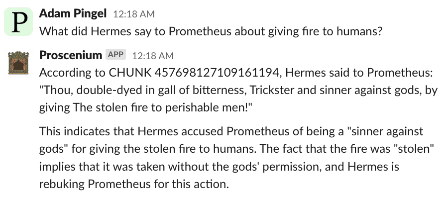

## Proscenium

Proscenium is an emerging library for building collaborative enterprise AI applications.

Sticking with the implied theater analogy,
the highest-level building block is a Production, which are composed of Scenes.
Scenes are composed of Characters and Props.

 

## Repository

See the [repository](https://github.com/The-AI-Alliance/proscenium) on GitHub.
Clone locally or start a [new GitHub Codespace](https://github.com/codespaces/new/The-AI-Alliance/proscenium)

## Colab Demos

- "Abacus" to use simple tools to respond to user questions. 
- "Literature" to use a vector database to store chunks of two books, and using those chunks to form a context for LLM inference based on a user question 
- "Slack" to attach Proscenium Productions (Scenes of Characters and Props) to Slack channels using a custom app. 

## Resources

For more background and future plans, see the [wiki](https://github.com/The-AI-Alliance/proscenium/wiki)

To find the Proscenium community, see the [discussions](https://github.com/The-AI-Alliance/proscenium/discussions)

## Use Cases

### Bartlebot

For federal case law research.  See the [website](https://the-ai-alliance.github.io/bartlebot/) and [repo](https://github.com/The-AI-Alliance/bartlebot)

## Library Design

Proscenium is being developed with an understanding that
details from specific enterprise application domains should be
prioritized in the early phases of its design.

The AI model, software, hardware, and cloud ecosystem is evolving rapidly.
Proscenium is designed to co-evolve with the ecosystem by keeping interfaces
simple and loosely-coupled.

The highest, app-level concepts are the theater-inspired classes.
Productions are composed of Scenes.
Scenes are composed of Characters and Props.

Under those higher-level classes are "patterns" for systems including:

- Document Enrichment
- Knowledge Graph Construction
- Entity Resolution
- RAG
- Graph RAG
- Tool Use

At the lowest level are "verbs" such as:
chunk, complete (inference), extract, and invoke (tools).
In many cases these are thin wrappers around well-known libraries.
