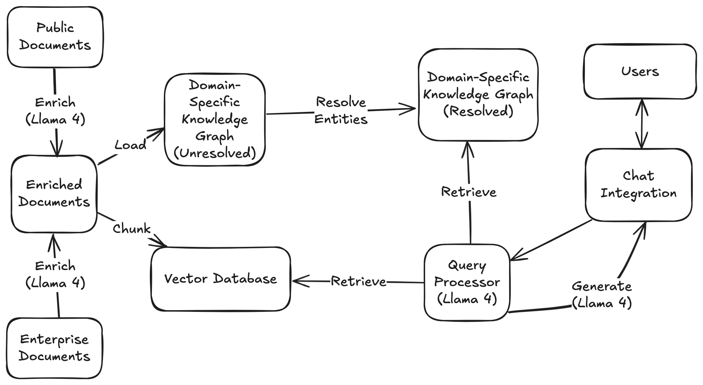

## Proscenium

Proscenium is an emerging library of composable glue that allows for succinct construction of enterprise AI applications.
It emphasizes support for domains where the creation and use of structured data is critical.

 

See the [repository](https://github.com/The-AI-Alliance/proscenium) on GitHub.

## Demos / Quickstart

The Proscenium repository includes a set of simple applications that demonstrate key features of the library.

There are two ways to get started quickly:

- [Notebooks](https://github.com/The-AI-Alliance/proscenium/tree/main/notebooks)

- [Command Line Interface](https://github.com/The-AI-Alliance/proscenium/blob/main/CLI.md) to demos, ither from a local repo clone or in a [new GitHub Codespace](https://github.com/codespaces/new/The-AI-Alliance/proscenium)

## Resources

For more background and future plans, see the [wiki](https://github.com/The-AI-Alliance/proscenium/wiki)

To find the Proscenium community, see the [discussions](https://github.com/The-AI-Alliance/proscenium/discussions)

## Motivation

Enterprise AI applications share many challenges with other Generative AI applications,
including the speed of evolution of model capabilities and the software ecosystem.

However, they also have qualities that warrant dedicated focus.
Proscenium is a library of patterns that emerge when building enterprise
AI applications and products for which accuracy and accountability are critical.

The use cases are "big picture" systems, not just product features.
For example they include steps such as:

1. Produce high-confidence, auditable results
2. Securely process enterprise data
3. Evaluate and report system quality and performance
4. Handle multi-modal user queries and data
5. Efficiently consume relevant data and reference material
6. Integrate with appropriate tools
7. Guide owners and subject-matter experts through system evolution options

The applications themselves are complete enough to provide insight
into specific user interactions, in a range of settings such as
integrations with chat systems or collaborative document editors.

Although the initial development of Proscenium targets
python notebooks (running locally or on Colab)
and command-line tools, Proscenium ultimately must be easily
deployable to enterprise-friendly platforms.
The first two target platforms are AWS and Llama Stack.

Finally, Proscenium is being developed with an understanding that
details from specific enterprise application domains should be
prioritized in the early phases of its design.

## Library Design

The AI model, software, hardware, and cloud ecosystem is evolving rapidly.
Proscenium is designed to co-evolve with the ecosystem by keeping interfaces
simple and loosely-coupled.

It's simplest offerings are low-level "verbs" such as:
chunk, complete (inference), extract, and invoke (tools).
In many cases these are thin wrappers around well-known libraries.

Those verbs are composed to form higher-level generic systems
including:

- Document Enrichment
- Knowledge Graph Construction
- Entity Resolution
- RAG
- Graph RAG
- Tool Use

## Demonstrations in the Legal Domain

Legal use cases rely heavily on deriving structured data from unstructured data, so this is an ideal domain to demonstrate several related subsystems.

### Federal Caselaw and Statute Research

The first use case in the legal domain is question-answering related to
large, public-domain legal datasets including U.S. federal case law and statutes.

The questions chosen highlight categories of questions where the ability to traverse a
Knowledge Graph provides advantages over a naive RAG approach.

### Email Generation with Context from Matter Management System

The second use case in development is a email authoring capability that
integrates with a Matter Management system.

### Common Features and Requirements

Demo applications will be demonstrated as Slack integrations as well as Python notebooks.

They will use Llama 4 models hosted by Together.AI, and make use of
a Neo4j graph database.

These applications will also demonstrate the creation and tuning of custom
benchmarks.  Existing legal benchmarks today are very narrow and/or do not map
well to customer value.
